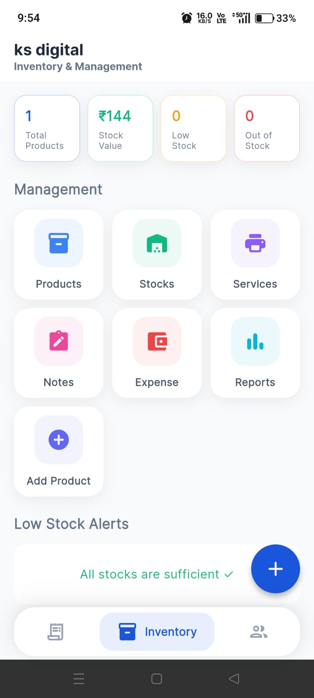
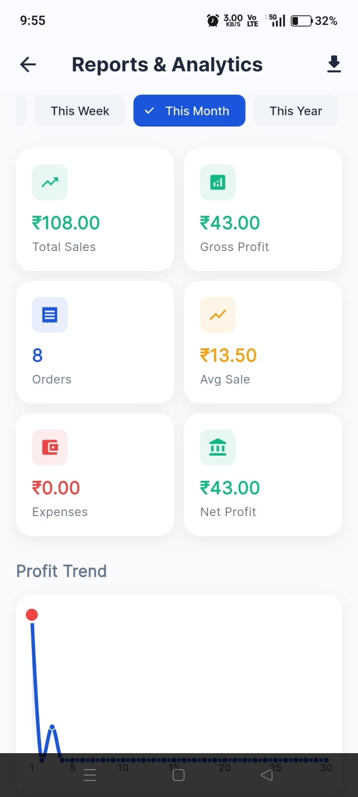
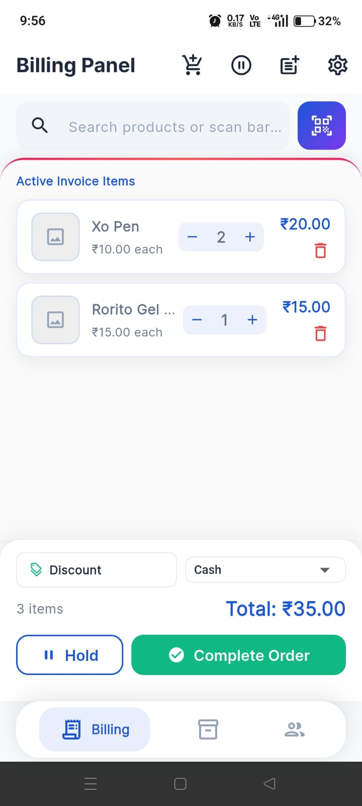

# 🧾 Smart Billing System – Manage Your Business Smarter

Smart Billing System is a modern billing and inventory management app built with Flutter and Firebase.

It helps shop owners create invoices, manage products, track inventory, monitor sales, record expenses, and analyze business performance — all in one place.

---

## 📸 Screenshots

<p align="center">
  
  
  
  
  
</p>

---

## 🚀 Features

### 🧾 Smart Billing
- Fast invoice generation
- Product search & billing
- PDF bill export
- WhatsApp bill sharing
- Multiple payment methods

### 📦 Inventory Management
- Product management
- Stock tracking
- Product image support
- Low stock monitoring

### 📊 Reports & Analytics
- Daily sales reports
- Monthly sales reports
- Revenue tracking
- Profit analysis

### 💰 Expense Management
- Expense recording
- Expense tracking
- Financial insights

### 📱 Barcode Scanner
- Instant product scanning
- Faster checkout process

### ☁️ Cloud Synchronization
- Firebase Authentication
- Cloud Firestore
- Real-time data sync
- Secure cloud storage

### 🏪 Multi-Shop Support
- Separate shop accounts
- Independent shop data
- Secure data isolation

---

## 🛠️ Tech Stack

- **Flutter (Dart)** – UI & application logic
- **Firebase Authentication** – Secure login
- **Cloud Firestore** – Cloud database
- **Firebase Storage** – Image storage
- **SQLite (sqflite)** – Local storage
- **Provider** – State management

---

## 🏗️ Project Structure

```bash
lib/
├── models/        Data models
├── providers/     Business logic
├── services/      Firebase services
├── screens/       UI screens
├── widgets/       Reusable widgets
└── main.dart

```

## ⚙️ How It Works

1. Add products to inventory
2. Create bills instantly
3. Track stock automatically
4. Monitor sales and expenses
5. Analyze business performance

---

## 📱 Screens

- Billing Screen
- Inventory Dashboard
- Reports & Analytics
- Expense Management
- Settings

---

## 🔐 Data & Privacy

- Firebase Authentication
- Secure user access
- Shop-wise data separation
- Cloud-backed storage

---

## 🎯 Goal

Smart Billing System focuses on one thing:

> Making billing and inventory management simple, fast, and reliable for businesses.

---

## 📌 Status

- ✅ Billing System
- ✅ Inventory Management
- ✅ Reports & Analytics
- ✅ Expense Tracking
- ✅ Barcode Scanner
- ✅ Firebase Integration

---

## 🤝 Contributing

Suggestions and improvements are always welcome.

---

## 📬 Contact

📧 [vjselvakumarofficial@gmail.com](mailto:vjselvakumarofficial@gmail.com)
